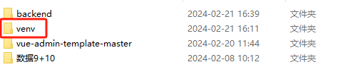
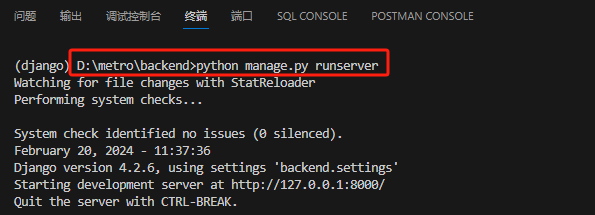

### 1. 创建一个虚拟环境后安装依赖
> 在前后端分离的总项目的 “根目录” 下面创建一个虚拟环境命名为 `venv`



```bash
python -m venv venv
```

> 激活虚拟环境：创建虚拟环境之后，需要激活它才能开始使用。在Windows上，可以通过以下命令激活虚拟环境

```bash
.\venv\Scripts\activate
```

> 接着 cd 到backend 这个后端 `project` 目录下面
```bash
cd backend
```

> 对刚刚创建的虚拟环境 `(venv)` 安装项目所需要的全部依赖
```bash
pip install -r requirements.txt
```

### 2. 对数据库产生迁移文件
> 这里我设置的是sqlite3，后续部署上线会换成 `mysql`

```bash
python manage.py makemigrations
```

### 3. 对数据库进行迁移并创建本地数据库 db.sqlite3
```bash
python manage.py migrate
```

### 4. 创建超级管理员
```bash
python manage.py createsuperuser
```

> 用户名 `username` 为：admin

> 邮箱随便填写：admin@gmail.com

> 密码 `password` 必须为：111111

> 忽略密码过于简单的报错 y

### 5. 启动后端服务器
```bash
python manage.py runserver
```

### 其中启动的端口为  `http://127.0.0.1:8000/`

